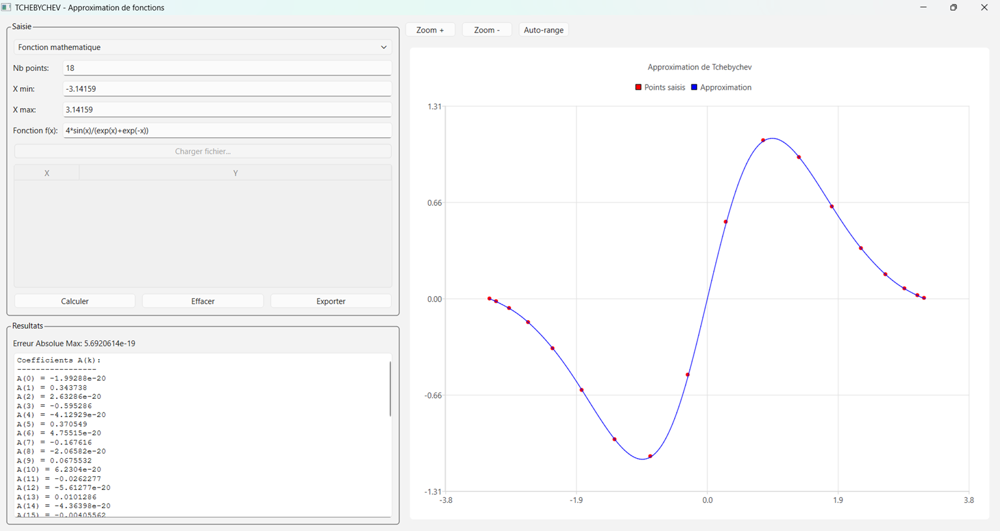

# TCHEBYCHEV — Approximation de fonctions par la methode de Tchebychev



## Description

Application graphique QT qui calcule le developpement limite d'une fonction selon la methode de Tchebychev. Elle prend en entree une liste de points (x, y) ou une expression mathematique, calcule les coefficients du polynome de Tchebychev, affiche la courbe d'approximation avec analyse de l'erreur, et permet d'exporter les resultats.

## Utilisation

### 1. Choix du mode de saisie

Trois modes disponibles dans la liste deroulante en haut du panneau gauche :

**Mode 1 — Points (saisie manuelle)**
- Entrez les valeurs X et Y directement dans le tableau
- Cliquez sur une cellule vide pour ajouter une ligne
- Nb points : le nombre de nœuds de Tchebychev utilises pour le calcul (2-255)
- X min / X max : intervalle de definition de l'approximation

**Mode 2 — Points (fichier texte)**
- Cliquez sur "Charger fichier..." pour importer un fichier .txt, .csv ou .dat
- Format attendu : une paire (x, y) par ligne, separee par espace, virgule ou point-virgule
- Les lignes commencant par # sont ignorees (commentaires)
- Les donnees apparaissent dans le tableau et peuvent etre modifiees avant calcul

**Mode 3 — Fonction mathematique**
- Entrez une expression dans le champ "Fonction f(x)"
- Expression par defaut : `4*sin(x)/(exp(x)+exp(-x))`
- Le programme evalue la fonction aux nœuds de Tchebychev (echantillonnage automatique)
- Nb points : nombre de nœuds d'echantillonnage
- X min / X max : intervalle d'evaluation

### 2. Calcul

Cliquez sur **"Calculer"** pour lancer l'approximation.

Le programme :
1. Echantillonne ou recupere les points d'entree
2. Calcule les coefficients Ak du developpement en polynomes de Tchebychev
3. Affiche les coefficients dans le panneau "Resultats"
4. Affiche la table de verification : X, Y original, Y approxime, erreur absolue, erreur relative
5. Calcule l'Erreur Absolue Maximale
6. Trace la courbe d'approximation (bleue) superposee aux points saisis (rouges)

### 3. Visualisation

Le graphique offre trois controles :
- **Zoom +** : agrandir la vue (facteur 1.5x)
- **Zoom -** : reduire la vue (facteur 0.666x)
- **Auto-range** : reajuster automatiquement les echelles X et Y aux donnees

### 4. Export

Cliquez sur **"Exporter"** pour sauvegarder l'integralite des resultats (coefficients, table de verification, erreur) dans un fichier texte.

### 5. Effacer

**"Effacer"** reinitialise le tableau, le graphique et les resultats.

## Algorithme

### Principe

L'approximation de Tchebychev consiste a exprimer une fonction f(x) sur un intervalle [Xmin, Xmax] comme une combinaison lineaire des polynomes de Tchebychev Tk(v).

### Changement de variable

```
v = 2 * (x - Xmin) / (Xmax - Xmin) - 1
```

v ∈ [-1, 1] quand x ∈ [Xmin, Xmax].

### Polynomes de Tchebychev

```
T0(v) = 1
T1(v) = v
Tk(v) = 2 * v * T[k-1](v) - T[k-2](v)   pour k >= 2
```

Propriete : Tk(cos θ) = cos(k θ)

### Nœuds de Tchebychev

Les nœuds sont les racines de TN(v) = 0 :
```
vj = cos((2*j + 1) * PI / (2*N))   pour j = 0, ..., N-1
xj = Xmin + (1 + vj) * (Xmax - Xmin) / 2
```

### Calcul des coefficients

```
Ak = 2/N * Somme[j=0 .. N-1] { yj * Tk(vj) }
```

ou yj = f(xj) (ou la valeur interpolee depuis les points fournis).

### Reconstitution

```
f(x) ≈ Somme[k=0 .. N-1] { Ak * Tk(v) }
```

### Interpolation des points utilisateur

En mode "points" (manuel ou fichier), les points fournis n'etant generalement pas aux nœuds de Tchebychev, le programme prend la valeur du point saisi le plus proche de chaque nœud.

## Build

### Windows (MinGW)
```batch
cd Windows
qmake TCHEBYCHEV.pro
mingw32-make
windeployqt release\TCHEBYCHEV.exe
```

### Windows (MSVC)
```batch
cd Windows
qmake TCHEBYCHEV.pro
nmake
windeployqt release\TCHEBYCHEV.exe
```

### Linux
```bash
cd linux
qmake TCHEBYCHEV.pro
make
```

## Dependances

- Qt 6.x (Core, Gui, Widgets, Charts)
- Compilateur C++17
- Bibliotheque math (libm sur Linux, integree sur Windows)

## Auteur

Projet original : Olivier Fournet
Port QT : 2026
